# Dockerizing a FastAPI app and a PostgreSQL database

Requisitos para rodar a aplicação: ter o Docker instalado.

[acesso aos arquivos](https://github.com/peuvitor/fastapi-docker)

## Overview

Criação de uma API em python utilizando o framework FastAPI que se conecta a um banco de dados PostgreSQL através do SQLAlchemy.

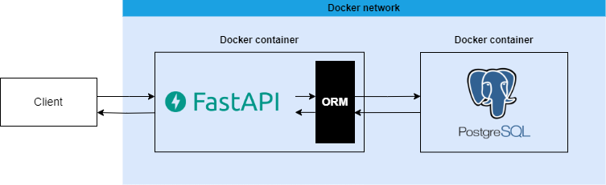

### Dataset

Disponível em: [NBA Stats (1947-present)](https://www.kaggle.com/datasets/sumitrodatta/nba-aba-baa-stats)

Download: 14/jun/2023 (última modificação no site: 07/mai/2023)

[Glossário das estatísticas](https://www.basketball-reference.com/about/glossary.html)

### PostgreSQL database

A partir dos [arquivos .csv](https://github.com/peuvitor/fastapi-docker/tree/main/nba-stats) da base de dados utilizada, foram criadas e populadas os schemas e as tabelas. Isso se deu adicionando os [arquivos .sql](https://github.com/peuvitor/fastapi-docker/tree/main/sql-scripts) de DDL e DML no diretório `docker-entrypoint-initdb.d`, utilizado por padrão para rodar scripts na inicialização do container.

## Estrutura do projeto

```                                             
project
│   README.md                     #
│   docker-compose.yml            # configurações dos containers
│   openai.json                   # descrição da API criada
│                                 #
└───app                           #
│   │   __init__.py               #
│   │   main.py                   # arquivo principal da aplicação
│   │   database.py               # conexão com o banco de dados
│   │                             #
│   └───models                    # estrutura base para consulta ao banco de dados
│       │   __init__.py           #
│       │   player.py             #
│       │   team.py               #
│   └───routers                   # organizar endpoints e métodos
│       │   __init__.py           #
│       │   player.py             #
│       │   team.py               #
│   └───schemas                   # validar requisições e padronizar respostas
│       │   __init__.py           #
│       │   player.py             #
│       │   team.py               #
│                                 #
└───dockerfiles                   #
│   └───fastapi                   # criar imagem para a API
│       │   Dockerfile            #
│       │   requirements.txt      #
│                                 #
└───sql-scripts                   # criar e popular banco de dados
│   │   create_tables.sql         #
│   │   fill_tables.sql           #
│                                 #
└───nba-stats                     # dados escolhidos como base para o banco de dados
    │   end-of-season-teams.csv   #             
    │   player-career-info.csv    #
    │   player-per-game.csv       #
    │   player-season-info.csv    #
    │   player-totals.csv         #
    │   team-stats-per-game.csv   #
    │   team-summaries.csv        #
    │   team-totals.csv           #
│                                 #
└───images                        # imagens para o README.md
    │   *.png                     #      
```

## FastAPI app

- endpoints relacionados aos times:

    - `/teams/`: informação de um time de acordo com parâmetros de consulta 

    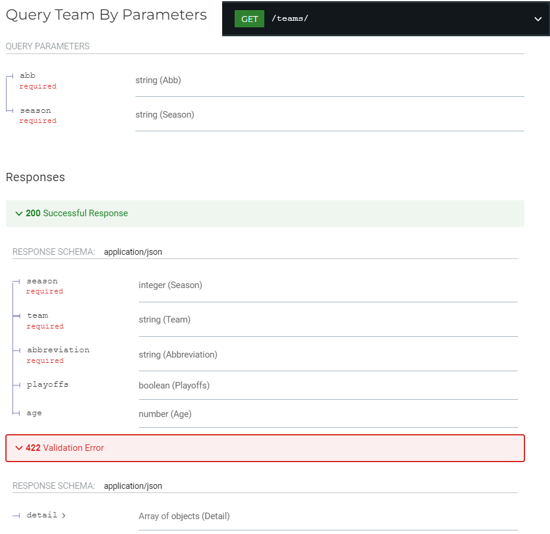

    - `/teams/{team_abb}`: informação de um time de acordo com parâmetros da rota

    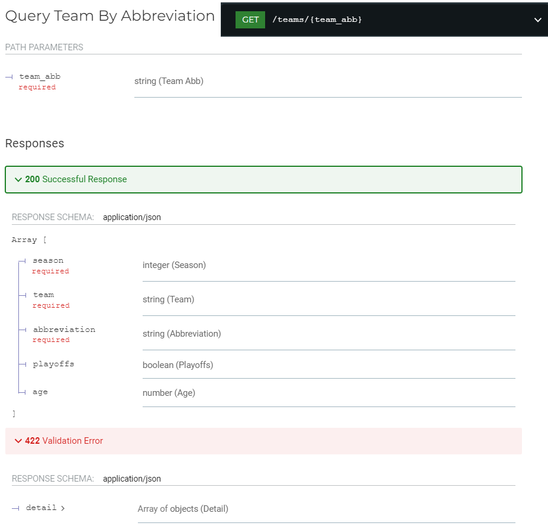

    - `/teams/`: criar um time de acordo com os dados passados no corpo da requisição

    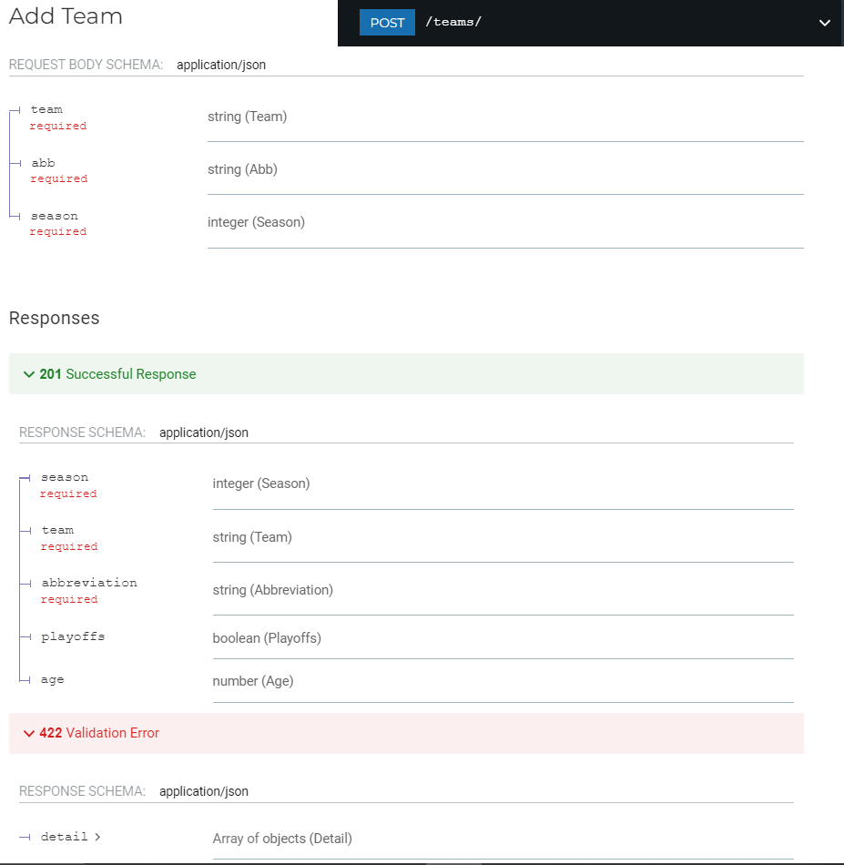

    - `/teams/{team_abb}/`: apagar um time de acordo com parâmetros da rota

    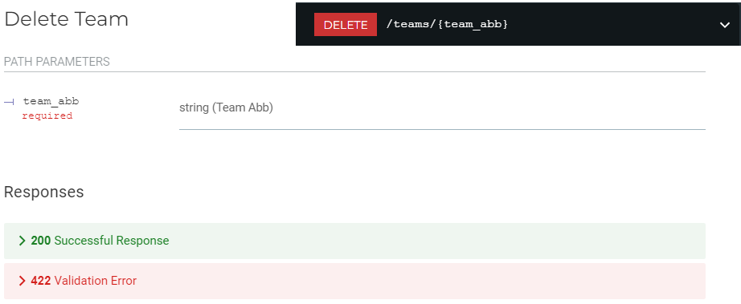

    - `/teams/stats-per-game/`: estatísticas por jogo de um time

    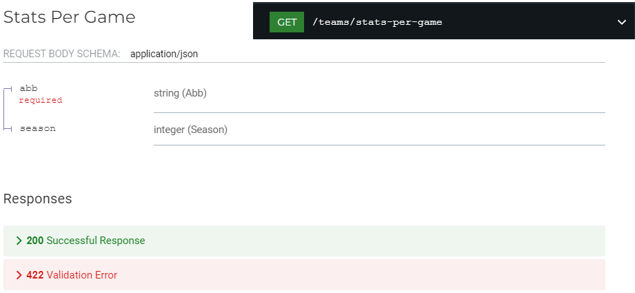

    - `/teams/totals/`: valores totais das estastísticas de um time

    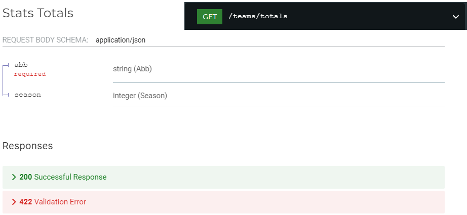

    - `/teams/season/{season}`: listar os times participantes de uma temporada

    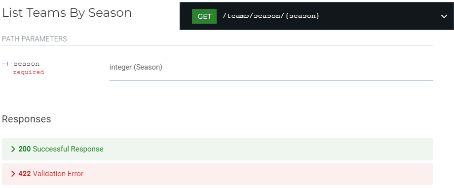

    - `/teams/end-of-season/{season}/`: listar os times de final de temporada

    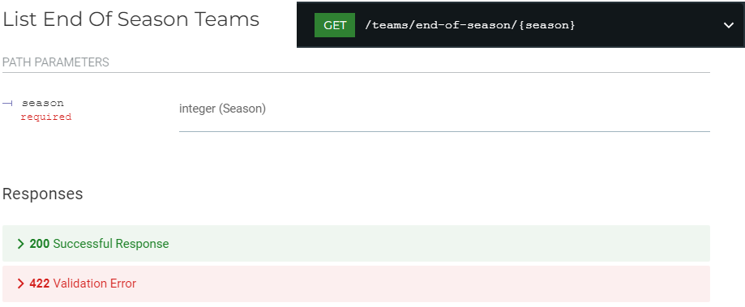


- endpoints relacionados aos jogadores:

    - `/players/`: participações de um jogador de acordo com os dados passados no corpo da requisição
    
    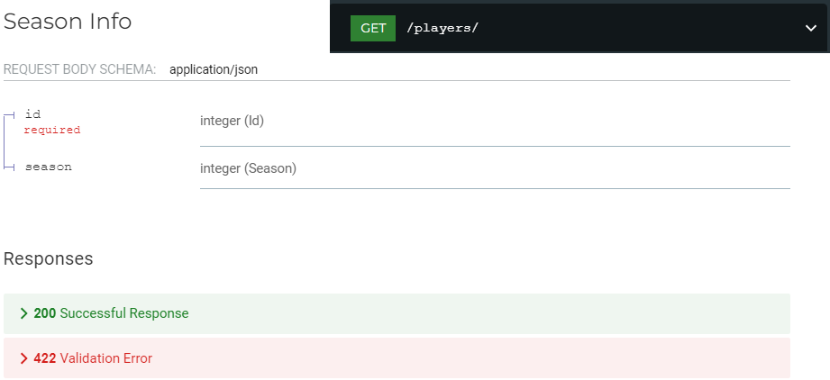

    - `/players/all`: listar todos os jogadores
    
    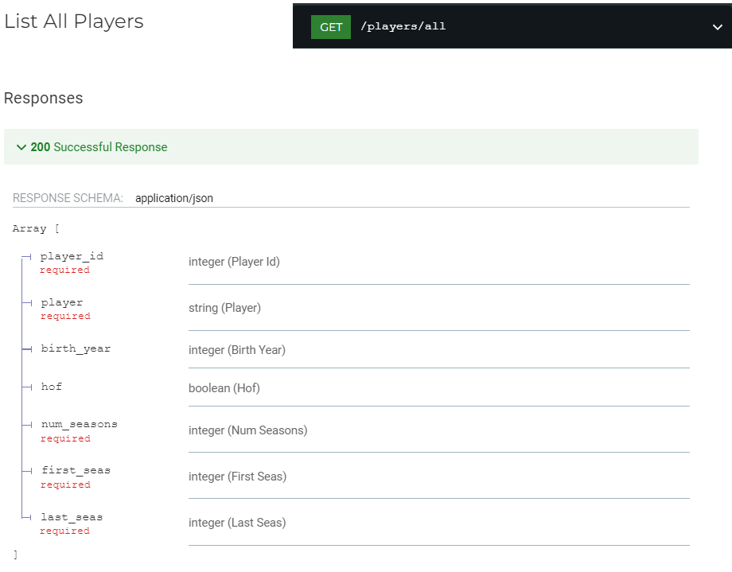

    - `/players/stats-per-game`: estatísticas por jogo de um jogador
    
    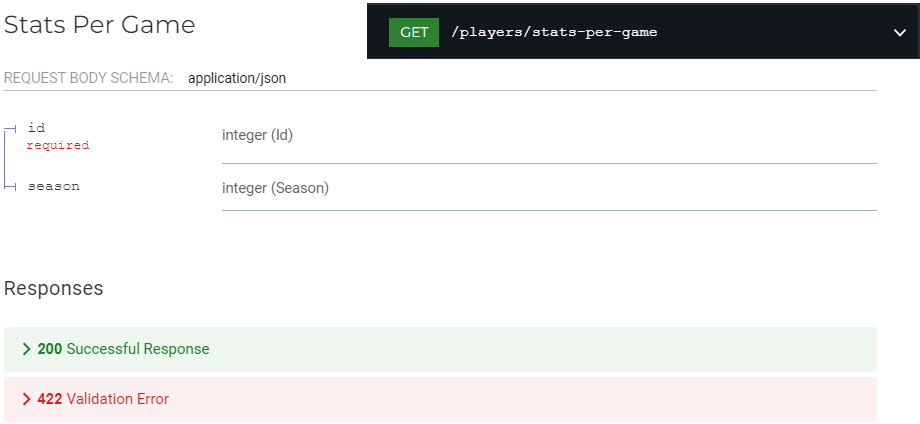

    - `/players/totals`: valores totais das estastísticas de um jogador
    
    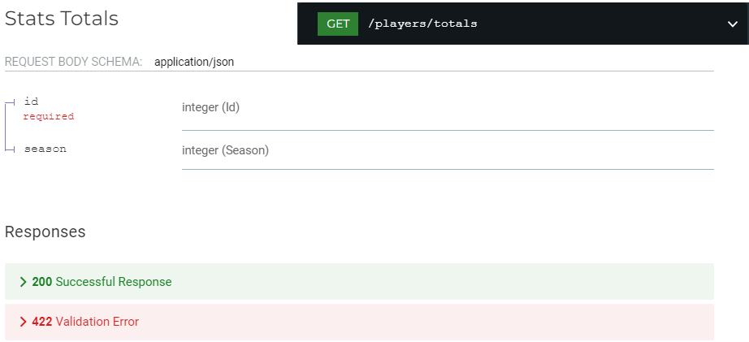

    - `/players/{player_id}`: informação de um jogador de acordo com parâmetros da rota
    
    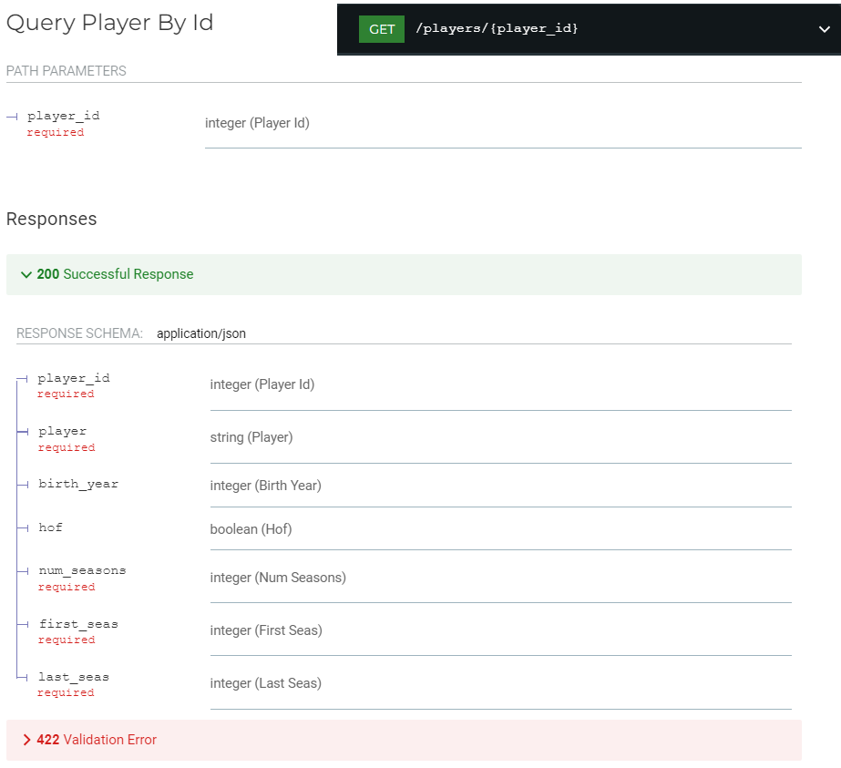


## Exemplos de funcionamento

`http://localhost:8000/teams?abb=DEN&season=2022`
```json
{
    "season": 2022,
    "team": "Denver Nuggets",
    "abbreviation": "DEN",
    "playoffs": true,
    "age": 27.7
}
```


`http://localhost:8000/teams/totals`

`request body: {"abb": "CHO"}`
```json
[
  {"fg": 3385, "x2pa": 4744, "ast": 2062, "season": 2023, "fga": 7413, "x2p_percent": 0.528, "stl": 634, "lg": "NBA", "fg_percent": 0.457, "ft": 1447, "blk": 425, "team": "Charlotte Hornets", "x3p": 881, "fta": 1933, "tov": 1164, "abbreviation": "CHO", "x3pa": 2669, "ft_percent": 0.749, "pf": 1661, "playoffs": false, "x3p_percent": 0.33, "orb": 901, "pts": 9098, "g": 82, "x2p": 2504, "drb": 2751, "mp": 19830, "trb": 3652
  },
  {"fg": 3508, "x2pa": 4367, "ast": 2302, "season": 2022, "fga": 7497, "x2p_percent": 0.542, "stl": 707, "lg": "NBA", "fg_percent": 0.468, "ft": 1298, "blk": 402, "team": "Charlotte Hornets", "x3p": 1143, "fta": 1753, "tov": 1087, "abbreviation": "CHO", "x3pa": 3130, "ft_percent": 0.74, "pf": 1629, "playoffs": false, "x3p_percent": 0.365, "orb": 888, "pts": 9457, "g": 82, "x2p": 2365, "drb": 2767, "mp": 19880, "trb": 3655
  },
  {"fg": 2875, "x2pa": 3658, "ast": 1933, "season": 2021, "fga": 6324, "x2p_percent": 0.517, "stl": 565, "lg": "NBA", "fg_percent": 0.455, "ft": 1146, "blk": 344, "team": "Charlotte Hornets", "x3p": 985, "fta": 1505, "tov": 1069, "abbreviation": "CHO", "x3pa": 2666, "ft_percent": 0.761, "pf": 1298, "playoffs": false, "x3p_percent": 0.369, "orb": 762, "pts": 7881, "g": 72, "x2p": 1890, "drb": 2389, "mp": 17355, "trb": 3151
  },
  {"fg": 2425, "x2pa": 3355, "ast": 1549, "season": 2020, "fga": 5586, "x2p_percent": 0.489, "stl": 428, "lg": "NBA", "fg_percent": 0.434, "ft": 1052, "blk": 268, "team": "Charlotte Hornets", "x3p": 785, "fta": 1406, "tov": 949, "abbreviation": "CHO", "x3pa": 2231, "ft_percent": 0.748, "pf": 1223, "playoffs": false, "x3p_percent": 0.352, "orb": 715, "pts": 6687, "g": 65, "x2p": 1640, "drb": 2066, "mp": 15750, "trb": 2781
  },
  {"fg": 3297, "x2pa": 4579, "ast": 1905, "season": 2019, "fga": 7362, "x2p_percent": 0.507, "stl": 591, "lg": "NBA", "fg_percent": 0.448, "ft": 1510, "blk": 405, "team": "Charlotte Hornets", "x3p": 977, "fta": 1895, "tov": 1001, "abbreviation": "CHO", "x3pa": 2783, "ft_percent": 0.797, "pf": 1550, "playoffs": false, "x3p_percent": 0.351, "orb": 814, "pts": 9081, "g": 82, "x2p": 2320, "drb": 2778, "mp": 19830, "trb": 3592
  },
  {"fg": 3197, "x2pa": 4873, "ast": 1770, "season": 2018, "fga": 7106, "x2p_percent": 0.487, "stl": 559, "lg": "NBA", "fg_percent": 0.45, "ft": 1656, "blk": 373, "team": "Charlotte Hornets", "x3p": 824, "fta": 2216, "tov": 1041, "abbreviation": "CHO", "x3pa": 2233, "ft_percent": 0.747, "pf": 1409, "playoffs": false, "x3p_percent": 0.369, "orb": 827, "pts": 8874, "g": 82, "x2p": 2373, "drb": 2901, "mp": 19780, "trb": 3728
  },
  {"fg": 3093, "x2pa": 4653, "ast": 1891, "season": 2017, "fga": 7000, "x2p_percent": 0.488, "stl": 571, "lg": "NBA", "fg_percent": 0.442, "ft": 1591, "blk": 390, "team": "Charlotte Hornets", "x3p": 824, "fta": 1953, "tov": 942, "abbreviation": "CHO", "x3pa": 2347, "ft_percent": 0.815, "pf": 1360, "playoffs": false, "x3p_percent": 0.351, "orb": 721, "pts": 8601, "g": 82, "x2p": 2269, "drb": 2853, "mp": 19830, "trb": 3574
  },
  {"fg": 3036, "x2pa": 4512, "ast": 1778, "season": 2016, "fga": 6922, "x2p_percent": 0.479, "stl": 595, "lg": "NBA", "fg_percent": 0.439, "ft": 1534, "blk": 438, "team": "Charlotte Hornets", "x3p": 873, "fta": 1941, "tov": 1030, "abbreviation": "CHO", "x3pa": 2410, "ft_percent": 0.79, "pf": 1487, "playoffs": true, "x3p_percent": 0.362, "orb": 734, "pts": 8479, "g": 82, "x2p": 2163, "drb": 2869, "mp": 19855, "trb": 3603
  },
  {"fg": 2913, "x2pa": 5366, "ast": 1654, "season": 2015, "fga": 6932, "x2p_percent": 0.45, "stl": 499, "lg": "NBA", "fg_percent": 0.42, "ft": 1397, "blk": 448, "team": "Charlotte Hornets", "x3p": 498, "fta": 1867, "tov": 976, "abbreviation": "CHO", "x3pa": 1566, "ft_percent": 0.748, "pf": 1494, "playoffs": false, "x3p_percent": 0.318, "orb": 820, "pts": 7721, "g": 82, "x2p": 2415, "drb": 2793, "mp": 19905, "trb": 3613
  }
]
```


`http://localhost:8000/teams/season/1996`
```json
[
  {"w": 46, "o_rtg": 109.4, "tov_percent": 14.0, "arena": "Omni Coliseum", "l": 36, "d_rtg": 108.0, "orb_percent": 34.0, "attend": 496668, "season": 1996, "pw": 45, "n_rtg": 1.4, "ft_fga": 0.229, "attend_g": 8297, "lg": "NBA", "pl": 37, "pace": 89.6, "opp_e_fg_percent": 0.512, "team": "Atlanta Hawks", "mov": 1.22, "f_tr": 0.302, "opp_tov_percent": 16.3, "abbreviation": "ATL", "sos": 0.07, "x3p_ar": 0.239, "opp_drb_percent": 67.1, "playoffs": true, "srs": 1.29, "ts_percent": 0.534, "opp_ft_fga": 0.217, "age": 28.1, "e_fg_percent": 0.49
  },
  {"w": 33, "o_rtg": 106.4, "tov_percent": 14.1, "arena": "FleetCenter", "l": 49, "d_rtg": 109.9, "orb_percent": 28.8, "attend": 730842, "season": 1996, "pw": 32, "n_rtg": -3.5, "ft_fga": 0.235, "attend_g": 17085, "lg": "NBA", "pl": 50, "pace": 96.2, "opp_e_fg_percent": 0.511, "team": "Boston Celtics", "mov": -3.4, "f_tr": 0.329, "opp_tov_percent": 14.3, "abbreviation": "BOS", "sos": 0.03, "x3p_ar": 0.209, "opp_drb_percent": 70.0, "playoffs": false, "srs": -3.37, "ts_percent": 0.534, "opp_ft_fga": 0.258, "age": 26.3, "e_fg_percent": 0.494
  },
  {"w": 41, "o_rtg": 111.2, "tov_percent": 14.1, "arena": "Charlotte Coliseum", "l": 41, "d_rtg": 111.8, "orb_percent": 29.5, "attend": 985722, "season": 1996, "pw": 39, "n_rtg": -0.6, "ft_fga": 0.246, "attend_g": 24042, "lg": "NBA", "pl": 43, "pace": 91.6, "opp_e_fg_percent": 0.529, "team": "Charlotte Hornets", "mov": -0.57, "f_tr": 0.32, "opp_tov_percent": 13.9, "abbreviation": "CHH", "sos": 0.09, "x3p_ar": 0.23, "opp_drb_percent": 70.3, "playoffs": false, "srs": -0.48, "ts_percent": 0.558, "opp_ft_fga": 0.217, "age": 27.8, "e_fg_percent": 0.514
  },
  {"w": 72, "o_rtg": 115.2, "tov_percent": 13.1, "arena": "United Center", "l": 10, "d_rtg": 101.8, "orb_percent": 36.9, "attend": 969149, "season": 1996, "pw": 70, "n_rtg": 13.4, "ft_fga": 0.217, "attend_g": null, "lg": "NBA", "pl": 12, "pace": 91.1, "opp_e_fg_percent": 0.482, "team": "Chicago Bulls", "mov": 12.24, "f_tr": 0.291, "opp_tov_percent": 16.1, "abbreviation": "CHI", "sos": -0.44, "x3p_ar": 0.196, "opp_drb_percent": 71.1, "playoffs": true, "srs": 11.8, "ts_percent": 0.555, "opp_ft_fga": 0.222, "age": 29.9, "e_fg_percent": 0.517
  },
  {"w": 47, "o_rtg": 109.9, "tov_percent": 13.7, "arena": "Gund Arena", "l": 35, "d_rtg": 106.7, "orb_percent": 28.6, "attend": 730095, "season": 1996, "pw": 49, "n_rtg": 3.2, "ft_fga": 0.226, "attend_g": null, "lg": "NBA", "pl": 33, "pace": 82.3, "opp_e_fg_percent": 0.506, "team": "Cleveland Cavaliers", "mov": 2.59, "f_tr": 0.296, "opp_tov_percent": 16.3, "abbreviation": "CLE", "sos": -0.09, "x3p_ar": 0.264, "opp_drb_percent": 70.2, "playoffs": true, "srs": 2.49, "ts_percent": 0.551, "opp_ft_fga": 0.242, "age": 27.5, "e_fg_percent": 0.51
  },
  {"w": 26, "o_rtg": 106.1, "tov_percent": 13.3, "arena": "Reunion Arena", "l": 56, "d_rtg": 111.2, "orb_percent": 34.1, "attend": 684138, "season": 1996, "pw": 28, "n_rtg": -5.1, "ft_fga": 0.192, "attend_g": null, "lg": "NBA", "pl": 54, "pace": 95.4, "opp_e_fg_percent": 0.526, "team": "Dallas Mavericks", "mov": -4.9, "f_tr": 0.266, "opp_tov_percent": 14.7, "abbreviation": "DAL", "sos": 0.19, "x3p_ar": 0.274, "opp_drb_percent": 68.6, "playoffs": false, "srs": -4.71, "ts_percent": 0.507, "opp_ft_fga": 0.222, "age": 25.1, "e_fg_percent": 0.47
  },
  {"w": 35, "o_rtg": 105.2, "tov_percent": 14.2, "arena": "McNichols Sports Arena", "l": 47, "d_rtg": 108.1, "orb_percent": 30.7, "attend": 675425, "season": 1996, "pw": 33, "n_rtg": -2.9, "ft_fga": 0.242, "attend_g": null, "lg": "NBA", "pl": 49, "pace": 92.2, "opp_e_fg_percent": 0.492, "team": "Denver Nuggets", "mov": -2.71, "f_tr": 0.326, "opp_tov_percent": 12.8, "abbreviation": "DEN", "sos": 0.09, "x3p_ar": 0.172, "opp_drb_percent": 72.7, "playoffs": false, "srs": -2.62, "ts_percent": 0.526, "opp_ft_fga": 0.237, "age": 26.8, "e_fg_percent": 0.481
  },
  {"w": 46, "o_rtg": 107.9, "tov_percent": 14.6, "arena": "The Palace of Auburn Hills", "l": 36, "d_rtg": 105.1, "orb_percent": 28.0, "attend": 730573, "season": 1996, "pw": 49, "n_rtg": 2.8, "ft_fga": 0.271, "attend_g": null, "lg": "NBA", "pl": 33, "pace": 87.7, "opp_e_fg_percent": 0.483, "team": "Detroit Pistons", "mov": 2.5, "f_tr": 0.36, "opp_tov_percent": 13.7, "abbreviation": "DET", "sos": -0.05, "x3p_ar": 0.221, "opp_drb_percent": 71.7, "playoffs": true, "srs": 2.45, "ts_percent": 0.551, "opp_ft_fga": 0.229, "age": 26.8, "e_fg_percent": 0.504
  },
  {"w": 36, "o_rtg": 108.4, "tov_percent": 14.8, "arena": "Oakland-Alameda County Coliseum Arena", "l": 46, "d_rtg": 109.9, "orb_percent": 33.9, "attend": 616025, "season": 1996, "pw": 37, "n_rtg": -1.5, "ft_fga": 0.265, "attend_g": null, "lg": "NBA", "pl": 45, "pace": 93.4, "opp_e_fg_percent": 0.51, "team": "Golden State Warriors", "mov": -1.45, "f_tr": 0.349, "opp_tov_percent": 15.2, "abbreviation": "GSW", "sos": 0.03, "x3p_ar": 0.179, "opp_drb_percent": 67.2, "playoffs": false, "srs": -1.42, "ts_percent": 0.539, "opp_ft_fga": 0.232, "age": 27.0, "e_fg_percent": 0.489
  },
  {"w": 48, "o_rtg": 109.3, "tov_percent": 14.1, "arena": "The Summit", "l": 34, "d_rtg": 107.4, "orb_percent": 26.9, "attend": 667840, "season": 1996, "pw": 46, "n_rtg": 1.9, "ft_fga": 0.243, "attend_g": 16611, "lg": "NBA", "pl": 36, "pace": 93.2, "opp_e_fg_percent": 0.495, "team": "Houston Rockets", "mov": 1.74, "f_tr": 0.317, "opp_tov_percent": 13.6, "abbreviation": "HOU", "sos": -0.12, "x3p_ar": 0.265, "opp_drb_percent": 68.6, "playoffs": true, "srs": 1.63, "ts_percent": 0.555, "opp_ft_fga": 0.206, "age": 29.0, "e_fg_percent": 0.512
  },
  {"w": 52, "o_rtg": 110.8, "tov_percent": 15.5, "arena": "Market Square Arena", "l": 30, "d_rtg": 107.2, "orb_percent": 33.0, "attend": 673967, "season": 1996, "pw": 50, "n_rtg": 3.6, "ft_fga": 0.294, "attend_g": null, "lg": "NBA", "pl": 32, "pace": 89.3, "opp_e_fg_percent": 0.491, "team": "Indiana Pacers", "mov": 3.24, "f_tr": 0.389, "opp_tov_percent": 14.7, "abbreviation": "IND", "sos": -0.14, "x3p_ar": 0.157, "opp_drb_percent": 69.3, "playoffs": true, "srs": 3.11, "ts_percent": 0.56, "opp_ft_fga": 0.271, "age": 29.4, "e_fg_percent": 0.509
  },
  {"w": 29, "o_rtg": 106.5, "tov_percent": 15.3, "arena": "Los Angeles Memorial Sports Arena", "l": 53, "d_rtg": 110.3, "orb_percent": 29.3, "attend": 405495, "season": 1996, "pw": 31, "n_rtg": -3.8, "ft_fga": 0.21, "attend_g": null, "lg": "NBA", "pl": 51, "pace": 93.2, "opp_e_fg_percent": 0.512, "team": "Los Angeles Clippers", "mov": -3.6, "f_tr": 0.3, "opp_tov_percent": 15.2, "abbreviation": "LAC", "sos": 0.13, "x3p_ar": 0.208, "opp_drb_percent": 67.9, "playoffs": false, "srs": -3.46, "ts_percent": 0.544, "opp_ft_fga": 0.282, "age": 25.2, "e_fg_percent": 0.511
  },
  {"w": 53, "o_rtg": 111.4, "tov_percent": 13.3, "arena": "Great Western Forum", "l": 29, "d_rtg": 106.6, "orb_percent": 30.1, "attend": 649634, "season": 1996, "pw": 53, "n_rtg": 4.8, "ft_fga": 0.228, "attend_g": 17505, "lg": "NBA", "pl": 29, "pace": 92.4, "opp_e_fg_percent": 0.491, "team": "Los Angeles Lakers", "mov": 4.45, "f_tr": 0.306, "opp_tov_percent": 14.9, "abbreviation": "LAL", "sos": -0.24, "x3p_ar": 0.203, "opp_drb_percent": 66.8, "playoffs": true, "srs": 4.21, "ts_percent": 0.555, "opp_ft_fga": 0.205, "age": 27.1, "e_fg_percent": 0.515
  },
  {"w": 42, "o_rtg": 105.3, "tov_percent": 16.0, "arena": "Miami Arena", "l": 40, "d_rtg": 103.8, "orb_percent": 30.1, "attend": 606088, "season": 1996, "pw": 45, "n_rtg": 1.5, "ft_fga": 0.245, "attend_g": null, "lg": "NBA", "pl": 37, "pace": 91.1, "opp_e_fg_percent": 0.469, "team": "Miami Heat", "mov": 1.43, "f_tr": 0.345, "opp_tov_percent": 14.8, "abbreviation": "MIA", "sos": 0.03, "x3p_ar": 0.23, "opp_drb_percent": 71.8, "playoffs": true, "srs": 1.46, "ts_percent": 0.541, "opp_ft_fga": 0.298, "age": 27.4, "e_fg_percent": 0.501
  },
  {"w": 25, "o_rtg": 105.6, "tov_percent": 15.0, "arena": "Bradley Center", "l": 57, "d_rtg": 111.5, "orb_percent": 29.7, "attend": 647088, "season": 1996, "pw": 26, "n_rtg": -5.9, "ft_fga": 0.218, "attend_g": null, "lg": "NBA", "pl": 56, "pace": 90.2, "opp_e_fg_percent": 0.52, "team": "Milwaukee Bucks", "mov": -5.3, "f_tr": 0.295, "opp_tov_percent": 14.1, "abbreviation": "MIL", "sos": 0.38, "x3p_ar": 0.163, "opp_drb_percent": 68.4, "playoffs": false, "srs": -4.92, "ts_percent": 0.534, "opp_ft_fga": 0.248, "age": 27.5, "e_fg_percent": 0.495
  },
  {"w": 26, "o_rtg": 104.1, "tov_percent": 16.0, "arena": "Target Center", "l": 56, "d_rtg": 109.8, "orb_percent": 29.8, "attend": 585669, "season": 1996, "pw": 26, "n_rtg": -5.7, "ft_fga": 0.277, "attend_g": null, "lg": "NBA", "pl": 56, "pace": 93.5, "opp_e_fg_percent": 0.509, "team": "Minnesota Timberwolves", "mov": -5.35, "f_tr": 0.357, "opp_tov_percent": 15.0, "abbreviation": "MIN", "sos": 0.22, "x3p_ar": 0.132, "opp_drb_percent": 68.7, "playoffs": false, "srs": -5.14, "ts_percent": 0.535, "opp_ft_fga": 0.267, "age": 26.4, "e_fg_percent": 0.48
  },
  {"w": 30, "o_rtg": 101.9, "tov_percent": 15.1, "arena": "Brendan Byrne Arena", "l": 52, "d_rtg": 106.5, "orb_percent": 36.4, "attend": 638144, "season": 1996, "pw": 29, "n_rtg": -4.6, "ft_fga": 0.248, "attend_g": null, "lg": "NBA", "pl": 53, "pace": 90.9, "opp_e_fg_percent": 0.495, "team": "New Jersey Nets", "mov": -4.23, "f_tr": 0.332, "opp_tov_percent": 14.5, "abbreviation": "NJN", "sos": 0.09, "x3p_ar": 0.111, "opp_drb_percent": 70.9, "playoffs": false, "srs": -4.14, "ts_percent": 0.497, "opp_ft_fga": 0.223, "age": 27.4, "e_fg_percent": 0.445
  },
  {"w": 47, "o_rtg": 106.0, "tov_percent": 14.9, "arena": "Madison Square Garden (IV)", "l": 35, "d_rtg": 103.5, "orb_percent": 25.5, "attend": 810283, "season": 1996, "pw": 48, "n_rtg": 2.5, "ft_fga": 0.232, "attend_g": null, "lg": "NBA", "pl": 34, "pace": 91.0, "opp_e_fg_percent": 0.476, "team": "New York Knicks", "mov": 2.32, "f_tr": 0.306, "opp_tov_percent": 14.8, "abbreviation": "NYK", "sos": -0.08, "x3p_ar": 0.201, "opp_drb_percent": 71.1, "playoffs": true, "srs": 2.24, "ts_percent": 0.55, "opp_ft_fga": 0.251, "age": 30.4, "e_fg_percent": 0.509
  },
  {"w": 60, "o_rtg": 112.9, "tov_percent": 13.2, "arena": "Orlando Arena", "l": 22, "d_rtg": 106.9, "orb_percent": 29.0, "attend": 707168, "season": 1996, "pw": 56, "n_rtg": 6.0, "ft_fga": 0.232, "attend_g": 17248, "lg": "NBA", "pl": 26, "pace": 91.8, "opp_e_fg_percent": 0.491, "team": "Orlando Magic", "mov": 5.56, "f_tr": 0.336, "opp_tov_percent": 14.0, "abbreviation": "ORL", "sos": -0.16, "x3p_ar": 0.248, "opp_drb_percent": 68.8, "playoffs": true, "srs": 5.4, "ts_percent": 0.562, "opp_ft_fga": 0.223, "age": 27.7, "e_fg_percent": 0.529
  },
  {"w": 18, "o_rtg": 102.2, "tov_percent": 16.0, "arena": "CoreStates Spectrum", "l": 64, "d_rtg": 113.0, "orb_percent": 29.4, "attend": 476016, "season": 1996, "pw": 16, "n_rtg": -10.8, "ft_fga": 0.259, "attend_g": null, "lg": "NBA", "pl": 66, "pace": 92.2, "opp_e_fg_percent": 0.522, "team": "Philadelphia 76ers", "mov": -10.0, "f_tr": 0.353, "opp_tov_percent": 14.4, "abbreviation": "PHI", "sos": 0.55, "x3p_ar": 0.224, "opp_drb_percent": 65.0, "playoffs": false, "srs": -9.45, "ts_percent": 0.522, "opp_ft_fga": 0.217, "age": 26.1, "e_fg_percent": 0.474
  },
  {"w": 41, "o_rtg": 110.3, "tov_percent": 13.5, "arena": "America West Arena", "l": 41, "d_rtg": 110.0, "orb_percent": 29.8, "attend": 779943, "season": 1996, "pw": 42, "n_rtg": 0.3, "ft_fga": 0.286, "attend_g": null, "lg": "NBA", "pl": 40, "pace": 93.2, "opp_e_fg_percent": 0.511, "team": "Phoenix Suns", "mov": 0.33, "f_tr": 0.37, "opp_tov_percent": 13.3, "abbreviation": "PHO", "sos": -0.05, "x3p_ar": 0.147, "opp_drb_percent": 71.4, "playoffs": true, "srs": 0.28, "ts_percent": 0.551, "opp_ft_fga": 0.225, "age": 27.9, "e_fg_percent": 0.498
  },
  {"w": 44, "o_rtg": 106.0, "tov_percent": 15.2, "arena": "Rose Garden Arena", "l": 38, "d_rtg": 103.5, "orb_percent": 33.4, "attend": 848055, "season": 1996, "pw": 48, "n_rtg": 2.5, "ft_fga": 0.23, "attend_g": null, "lg": "NBA", "pl": 34, "pace": 92.6, "opp_e_fg_percent": 0.478, "team": "Portland Trail Blazers", "mov": 2.35, "f_tr": 0.347, "opp_tov_percent": 13.5, "abbreviation": "POR", "sos": -0.14, "x3p_ar": 0.203, "opp_drb_percent": 73.4, "playoffs": true, "srs": 2.21, "ts_percent": 0.528, "opp_ft_fga": 0.236, "age": 28.1, "e_fg_percent": 0.494
  },
  {"w": 39, "o_rtg": 106.2, "tov_percent": 16.0, "arena": "ARCO Arena (II)", "l": 43, "d_rtg": 109.1, "orb_percent": 32.5, "attend": 709999, "season": 1996, "pw": 33, "n_rtg": -2.9, "ft_fga": 0.271, "attend_g": null, "lg": "NBA", "pl": 49, "pace": 93.4, "opp_e_fg_percent": 0.498, "team": "Sacramento Kings", "mov": -2.71, "f_tr": 0.371, "opp_tov_percent": 15.1, "abbreviation": "SAC", "sos": 0.09, "x3p_ar": 0.184, "opp_drb_percent": 69.0, "playoffs": true, "srs": -2.62, "ts_percent": 0.54, "opp_ft_fga": 0.302, "age": 26.6, "e_fg_percent": 0.493
  },
  {"w": 59, "o_rtg": 110.2, "tov_percent": 13.6, "arena": "Alamodome", "l": 23, "d_rtg": 103.5, "orb_percent": 27.5, "attend": 782701, "season": 1996, "pw": 58, "n_rtg": 6.7, "ft_fga": 0.252, "attend_g": 18752, "lg": "NBA", "pl": 24, "pace": 93.3, "opp_e_fg_percent": 0.472, "team": "San Antonio Spurs", "mov": 6.3, "f_tr": 0.342, "opp_tov_percent": 13.9, "abbreviation": "SAS", "sos": -0.33, "x3p_ar": 0.2, "opp_drb_percent": 70.0, "playoffs": true, "srs": 5.98, "ts_percent": 0.558, "opp_ft_fga": 0.216, "age": 29.4, "e_fg_percent": 0.516
  },
  {"w": 64, "o_rtg": 110.3, "tov_percent": 16.2, "arena": "KeyArena at Seattle Center", "l": 18, "d_rtg": 102.1, "orb_percent": 29.7, "attend": 697301, "season": 1996, "pw": 61, "n_rtg": 8.2, "ft_fga": 0.288, "attend_g": 16646, "lg": "NBA", "pl": 21, "pace": 93.8, "opp_e_fg_percent": 0.479, "team": "Seattle SuperSonics", "mov": 7.79, "f_tr": 0.379, "opp_tov_percent": 16.7, "abbreviation": "SEA", "sos": -0.4, "x3p_ar": 0.249, "opp_drb_percent": 69.5, "playoffs": true, "srs": 7.4, "ts_percent": 0.574, "opp_ft_fga": 0.252, "age": 29.6, "e_fg_percent": 0.526
  },
  {"w": 21, "o_rtg": 103.8, "tov_percent": 17.2, "arena": "SkyDome", "l": 61, "d_rtg": 111.8, "orb_percent": 32.0, "attend": 950330, "season": 1996, "pw": 21, "n_rtg": -8.0, "ft_fga": 0.214, "attend_g": null, "lg": "NBA", "pl": 61, "pace": 93.2, "opp_e_fg_percent": 0.514, "team": "Toronto Raptors", "mov": -7.51, "f_tr": 0.296, "opp_tov_percent": 14.7, "abbreviation": "TOR", "sos": 0.31, "x3p_ar": 0.177, "opp_drb_percent": 66.8, "playoffs": false, "srs": -7.2, "ts_percent": 0.536, "opp_ft_fga": 0.272, "age": 26.1, "e_fg_percent": 0.499
  },
  {"w": 55, "o_rtg": 113.3, "tov_percent": 14.1, "arena": "Delta Center", "l": 27, "d_rtg": 106.1, "orb_percent": 31.6, "attend": 813073, "season": 1996, "pw": 59, "n_rtg": 7.2, "ft_fga": 0.276, "attend_g": 19911, "lg": "NBA", "pl": 23, "pace": 90.0, "opp_e_fg_percent": 0.489, "team": "Utah Jazz", "mov": 6.59, "f_tr": 0.359, "opp_tov_percent": 15.1, "abbreviation": "UTA", "sos": -0.34, "x3p_ar": 0.158, "opp_drb_percent": 71.7, "playoffs": true, "srs": 6.25, "ts_percent": 0.566, "opp_ft_fga": 0.295, "age": 29.5, "e_fg_percent": 0.517
  },
  {"w": 15, "o_rtg": 97.6, "tov_percent": 15.5, "arena": "General Motors Place", "l": 67, "d_rtg": 108.5, "orb_percent": 27.3, "attend": 654013, "season": 1996, "pw": 15, "n_rtg": -10.9, "ft_fga": 0.223, "attend_g": 19193, "lg": "NBA", "pl": 67, "pace": 91.0, "opp_e_fg_percent": 0.51, "team": "Vancouver Grizzlies", "mov": -9.98, "f_tr": 0.308, "opp_tov_percent": 16.1, "abbreviation": "VAN", "sos": 0.43, "x3p_ar": 0.174, "opp_drb_percent": 66.3, "playoffs": false, "srs": -9.55, "ts_percent": 0.5, "opp_ft_fga": 0.241, "age": 27.2, "e_fg_percent": 0.456
  },
  {"w": 39, "o_rtg": 108.7, "tov_percent": 15.0, "arena": "US Airways Arena", "l": 43, "d_rtg": 107.6, "orb_percent": 28.2, "attend": 669598, "season": 1996, "pw": 44, "n_rtg": 1.1, "ft_fga": 0.228, "attend_g": null, "lg": "NBA", "pl": 38, "pace": 93.7, "opp_e_fg_percent": 0.489, "team": "Washington Bullets", "mov": 1.06, "f_tr": 0.314, "opp_tov_percent": 15.0, "abbreviation": "WSB", "sos": -0.07, "x3p_ar": 0.183, "opp_drb_percent": 67.8, "playoffs": false, "srs": 0.99, "ts_percent": 0.558, "opp_ft_fga": 0.274, "age": 24.8, "e_fg_percent": 0.521
  },
  {"w": null, "o_rtg": 107.6, "tov_percent": 14.7, "arena": null, "l": null, "d_rtg": 107.6, "orb_percent": 30.6, "attend": 703139, "season": 1996, "pw": 41, "n_rtg": null, "ft_fga": 0.243, "attend_g": 18173, "lg": "NBA", "pl": 41, "pace": 91.8, "opp_e_fg_percent": 0.499, "team": "League Average", "mov": 0.0, "f_tr": 0.329, "opp_tov_percent": 14.7, "abbreviation": null, "sos": 0.0, "x3p_ar": 0.2, "opp_drb_percent": 69.4, "playoffs": false, "srs": 0.0, "ts_percent": 0.542, "opp_ft_fga": 0.243, "age": 27.6, "e_fg_percent": 0.499
  }
]
```


`http://localhost:8000/players/3000`
```json
{"player_id": 3000, "player": "Kobe Bryant", "birth_year": null, "hof": true, "num_seasons": 20, "first_seas": 1997, "last_seas": 2016}
```


`http://localhost:8000/players/stats-per-game`

`request body: {"id": 3000, "season": 2008}:`
```json
[{"experience": 12, "fga_per_game": 20.6, "e_fg_percent": 0.503, "ast_per_game": 5.4, "seas_id": 21299, "lg": "NBA", "fg_percent": 0.459, "ft_per_game": 7.6, "stl_per_game": 1.8, "season": 2008, "tm": "LAL", "x3p_per_game": 1.8, "fta_per_game": 9.0, "blk_per_game": 0.5, "player_id": 3000, "g": 82, "x3pa_per_game": 5.1, "ft_percent": 0.84, "tov_per_game": 3.1, "player": "Kobe Bryant", "gs": 82, "x3p_percent": 0.361, "orb_per_game": 1.1, "pf_per_game": 2.8, "birth_year": null, "mp_per_game": 38.9, "x2p_per_game": 7.6, "drb_per_game": 5.2, "pts_per_game": 28.3, "pos": "SG", "fg_per_game": 9.5, "x2pa_per_game": 15.5, "trb_per_game": 6.3, "age": 29, "x2p_percent": 0.49}]
```